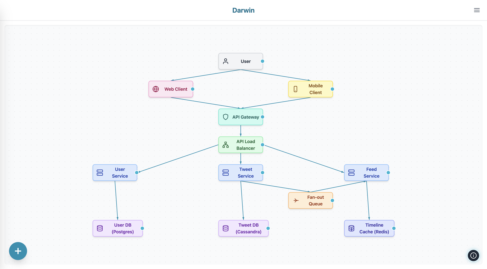

# Darwin: High-Level Design Diagram Builder




Darwin is an interactive web application for creating High-Level Design (HLD) diagrams. Effortlessly drag and drop components like load balancers, databases, microservices, and more onto a canvas, connect them visually, and export or import your designs. Darwin is ideal for architects, engineers, and students who want to quickly sketch, share, and iterate on system architectures.

## Darwin in action

> Replace this with your own GIF or video demo if needed. Place the file in a `screenshots/` folder at the project root.

<p align="center">
  
  <!-- Or use a video: -->
  <!-- <video src="screenshots/darwin-demo.mp4" controls width="600"></video> -->
</p>

| Desktop View | Mobile View |
|:---:|:---:|
|  |  |


## Features

- **Drag & Drop Canvas:** Add, move, resize, and connect components visually.
- **Predefined & Custom Elements:** Includes icons for users, web/mobile clients, gateways, databases, caches, queues, and more. Add your own custom elements as needed.
- **Smart Connectors:** Draw arrows between components; connectors adjust automatically as you move elements.
- **Undo/Redo:** Full undo/redo support for all actions.
- **Multi-Select & Area Select:** Select multiple elements by holding space and dragging, or by clicking with modifiers.
- **Rename & Edit:** Double-click to rename any element.
- **Responsive UI:** Works beautifully on desktop and mobile devices.
- **Export/Import:** Export your diagram as PNG/JPEG image or JSON. Import diagrams from JSON files.
- **Example Architectures:** Load sample diagrams for e-commerce, social media, and video streaming systems.

## Getting Started

### Prerequisites
- [Node.js](https://nodejs.org/) (v18 or newer recommended)

### Installation

1. **Clone the repository:**
   ```bash
   git clone <your-repo-url>
   cd darwin
   ```
2. **Install dependencies:**
   ```bash
   npm install
   ```

### Running Locally

Start the development server:
```bash
npm run dev
```
Visit [http://localhost:5173](http://localhost:5173) in your browser.

### Building for Production

```bash
npm run build
```
The output will be in the `dist/` directory. You can preview the production build with:
```bash
npm run preview
```

## Usage Tips

- **Zoom:** Use mouse wheel or pinch on touch devices.
- **Pan:** Drag the canvas background.
- **Area Select:** Hold <kbd>Space</kbd> and drag to select multiple elements.
- **Multi-Select:** Hold <kbd>Space</kbd> and click elements.
- **Delete:** Select elements and press <kbd>Delete</kbd>.
- **Undo/Redo:** <kbd>Cmd/Ctrl + Z</kbd> and <kbd>Cmd/Ctrl + Y</kbd>.
- **Export:** Use the export menu to save as image or JSON.
- **Import:** Use the import menu to load a diagram from JSON.

## Example Diagrams

Find example architectures in the `examples/` and `public/examples/` folders:
- E-commerce Platform
- Social Media System
- Video Streaming Service

You can load these from the app's example menu.

## Project Structure

- `components/` – React components for the UI and canvas
- `hooks/` – Custom React hooks (e.g., undo/redo, media queries)
- `examples/` – Example diagram JSONs
- `public/` – Static assets and public example diagrams
- `types.ts` – TypeScript types for elements, connectors, diagrams
- `constants.tsx` – Default element configs and dimensions
- `App.tsx` – Main application logic
- `index.tsx` – Entry point

## Tech Stack
- [React 19](https://react.dev/)
- [Vite](https://vitejs.dev/)
- [Tailwind CSS](https://tailwindcss.com/) (via CDN)
- TypeScript

## License

MIT License. See [LICENSE](LICENSE) for details.

---

*Made with ❤️ for system designers and architects.*
